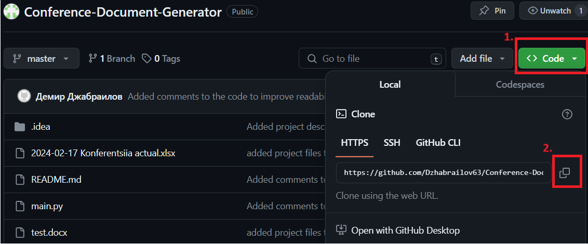
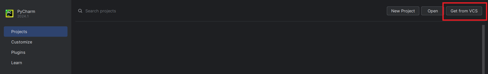
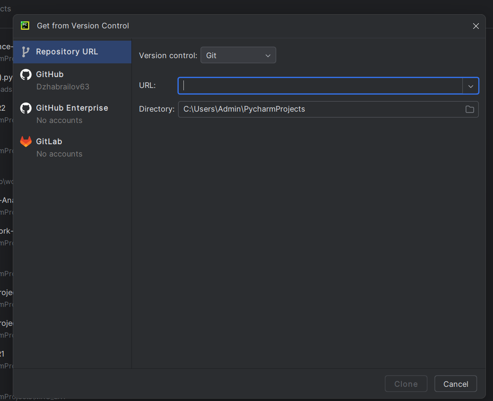
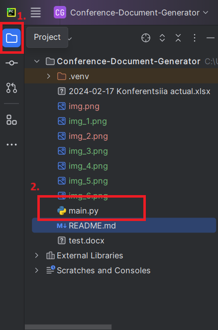
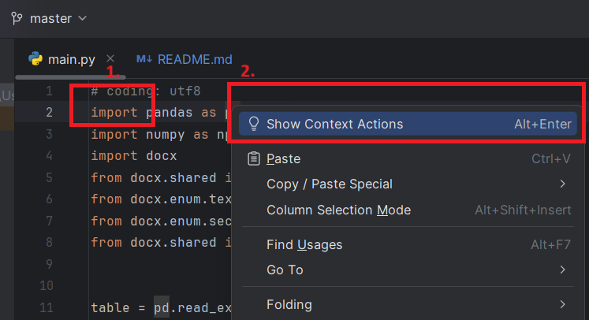
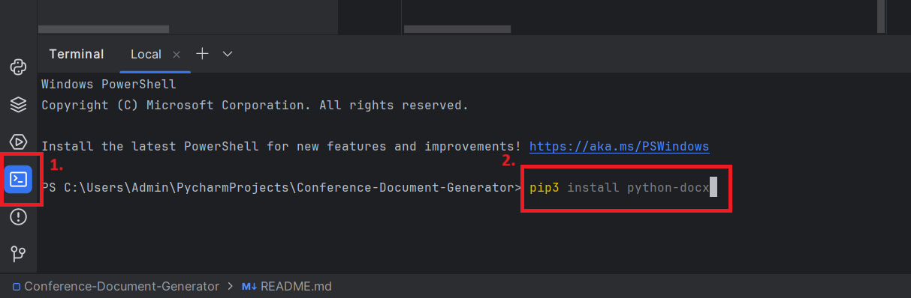
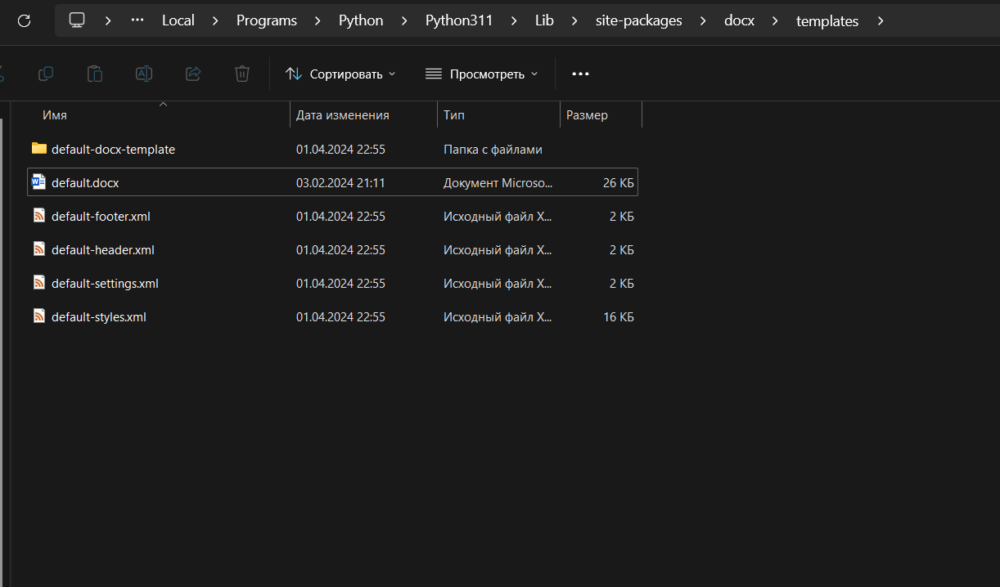

# Conference-Document-Generator
## Описание проекта
Данный проект является реализацией приложения, которое формирует файл содержащий программу ежегодной молодежной научной конференции, проходящей в Самарском университете.

Проект состоит из двух составных частей: Яндекс Форма и скрипт, который, обработав XLSX таблицу (таблицу Excel), содержащую ответы на форму, формирует готовый файл с нужными стилями и содержанием точно в том виде, которое предусмотрено в требованиях к оформлению программы.

## Установка
### Для работы с данным инструментом понадобится установленный на ПК IDE для работы с python.
### Авторы проекта использовали IDE [PyCharm Community](https://www.jetbrains.com/pycharm/download/?section=windows).

1. Открыв PyCharm необходимо склонировать проект из [репозитория на GitHub](https://github.com/Dzhabrailov63/Conference-Document-Generator.git)
    
    1.1. Копируем [URL](https://github.com/Dzhabrailov63/Conference-Document-Generator.git) репозитория для клонирования 
        
    1.2. Открываем PyCharm и на начальном окне выбираем кнопку "Get from VCS"
        png](img_1.png)
    1.3. Вставляем ссылку в появившееся поле и "Clone"
        
2. Теперь отроем код приложения, чтобы установить библиотеки.

3. После клонирования репозитория нужно установить библиотеки
    
    3.1 Первые строки кода являются прописанными библиотеками необходимые для импорта. Первые две из них нужно установить нажав ПКМ на "import" затем "Show context actions" и там уже install

    
    3.2 Затем необходимо установить библиотеку "docx". Это делается через терминал. Кликаем по кнопке терминала (1.), вводим команду (2.).

4. Осталось добавить файл с подготовленным для составления программы стилем.
    для этого нужно файл "default.docx" из репозитория заменить на файл "default.docx" из данного репозитория в папку по пути "C:\Users\Admin\AppData\Local\Programs\Python\Python311\Lib\site-packages\docx\templates"

### Скрипт готов к использованию.